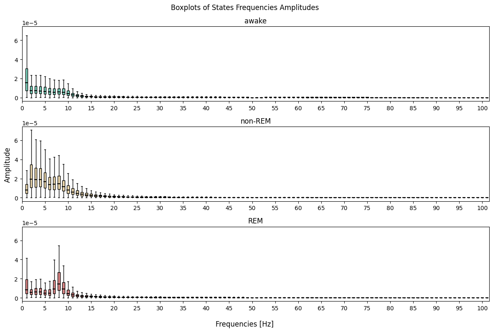
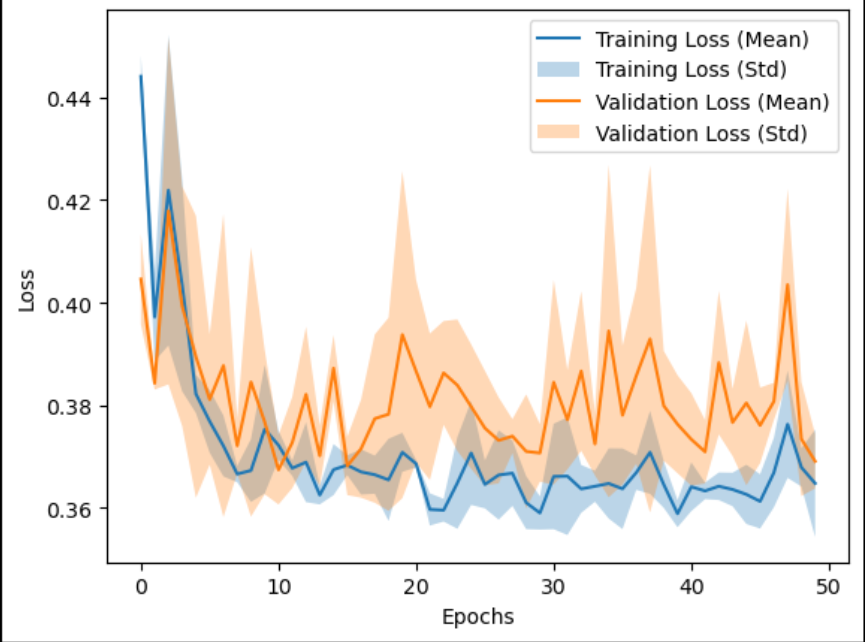
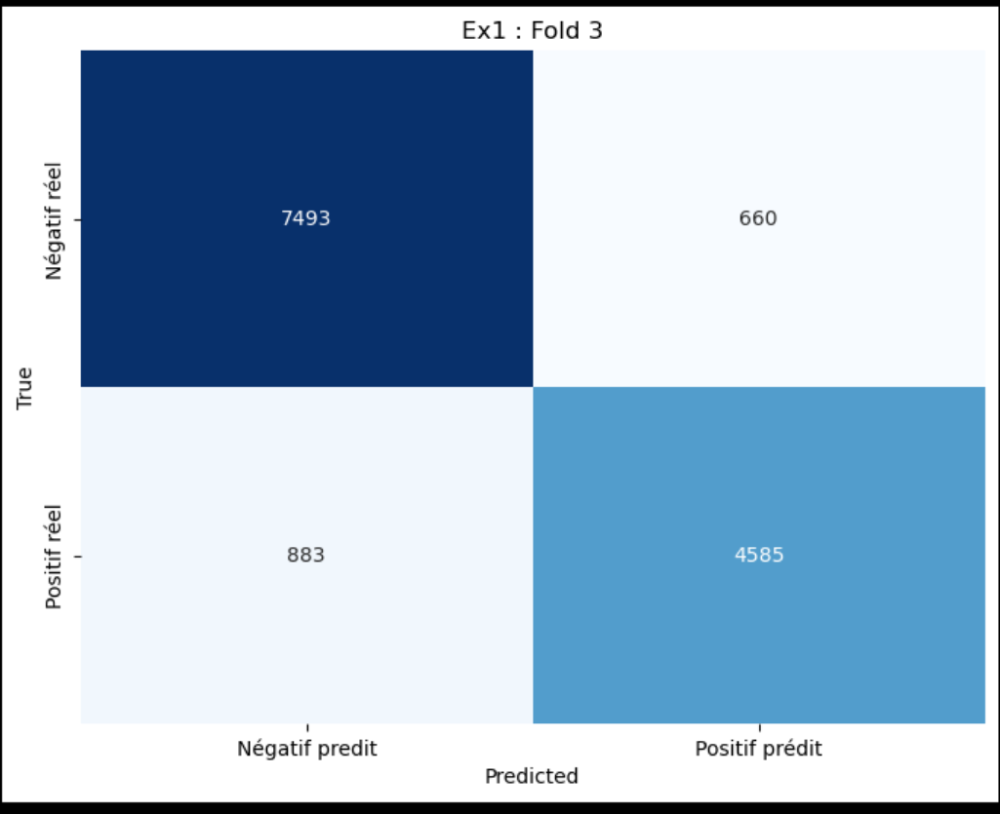
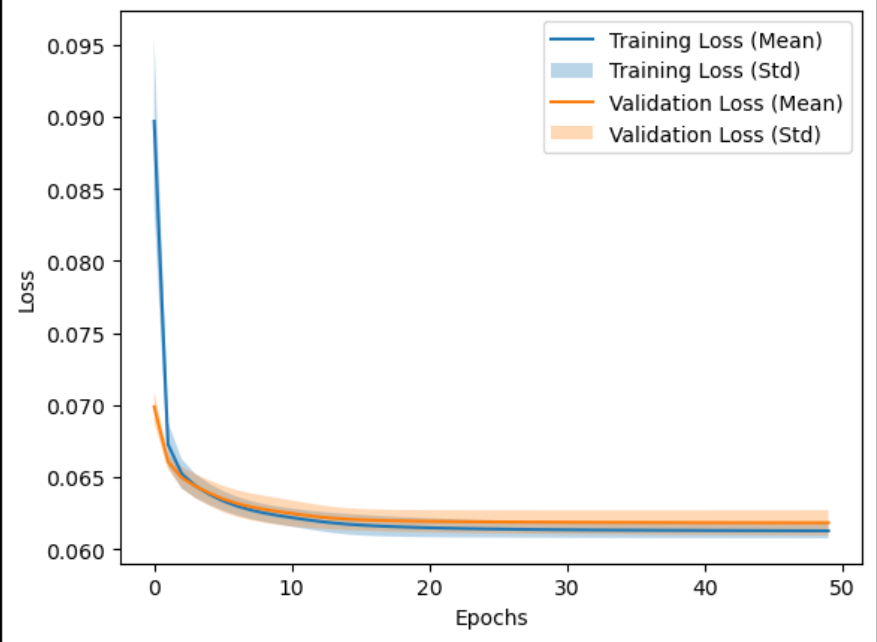
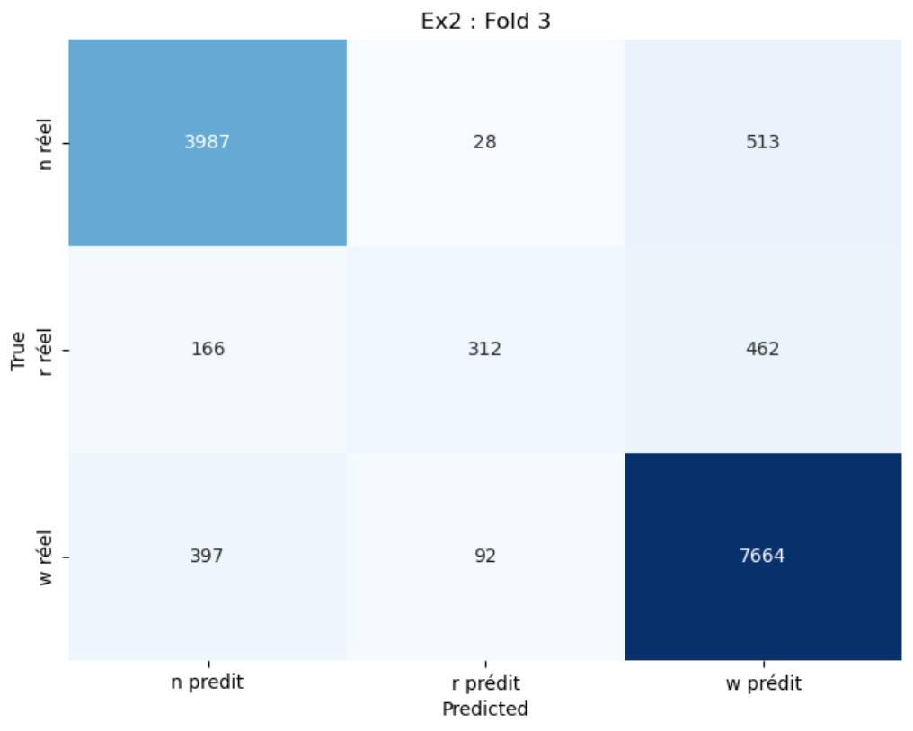

# Practical Work 3
#### Auteurs : Dousse Rafael & Baquerizo Emily

## Introduction

Ce travail pratique a pour but de mettre en pratique les connaissances acquises durant nos précédent laboratoires afin d'implémenter des MLPs (Multi-Layer Perceptrons) afin de résoudre des problèmes de classification.  Dans notre cas, nous utilisons la base de données `EEG_mouse_data` qui contient des données d'EEG de souris c'est a dire des données prises sur le cerveau de souris et qui représentent le cycle de sommeil de ces dernières.

Pour pouvoir réaliser ce travail, nous avons utilisé la librairie keras qui est une librairie open-source qui permet de créer des réseaux de neurones de manière simple et rapide. Finalement, nous vérifions les données de notre modèle en faisant une validation croisée et en affichant les matrices de confusions et les F1-scores.

## Exercice 1 :  Classification de 2 classes

Pour ce travail nous avons eu accès a une base de données `EEG_mouse_data` qui contient des données d'EEG de souris. Cette base contient plus d'une centaine de colonnes sur l'amplitude des fréquences de l'EEG de souris. Pour avoir des résultats plus pertinents et précis, nous avons décidé de ne prendre que les colonnes dont l'amplitude des fréquences sont les plus significatives et pour faire cela on peut remarquer, grâce à un tableau de boxplot prit sur le laboratoire 1, que les colonnes les plus utiles sont dans les 20 premières. 

1. Préparation des données

Pour commencer la première partie de ce travail, nous avons commencé par importer les données de la base de données `EEG_mouse_data` et nous avons effectué un prétraitement des données en utilisant la colonne des états et en la transformant en deux classes. On a regroupé les états n-rem et rem ensemble en un état asleep qu on a donné la valeur 1 et l'état awake qu'on a donné la valeur de -1. Ensuite, nous avons normalisé les données grâce a la fonction `StandardScaler` de sklearn.

2. Création de modèle

Pour le modèle nous avons utilisé un MLP avec 1 couche caché de 4 neuronnes et une sortie de 1 neuronne. Nous avons utilisé la fonction d'activation tanh comme pour la couche cachée ainsi que pour la couche de sortie. Ce n'est pas un choix original mais elle a été moticé par le fait que nous avons classifié nos valeurs dans un interval de [-1,1]. Enfin, nous avons utilisé comme learning rate 0.01 et momentum 0.9.

3. Entraînement et résultats

Nous avons fait un entrainement sur 50 epochs et avons décider de split nos données en 3 k-folds pour la validation croisée. Le graphique qui suit nous montre que la perte de nos medèles diminue au fur et à mesure des epochs et ne semble pas diverger en remontant ce qui montre qu'on a pas d'overfitting. Par contre, le modèle ne semble pas converger non plus. Plus d'epochs ou un changement de learning rate pourraient améliorer les résultats. Un learning rate plus petit pourrait permettre de converger plus rapidement et d'avoir moir de fluctuation dans la perte.

On a pas une perte très élevée mais elle reste assez haute avec un minimum de 0.36 et cela pourrait être amélioré.

La matrice de confusion et la moyenne des F1-scores que nous obtenons et qui est de : 0.855 indique ce que nous avons pu voir avec le graphique de la perte. Un score de 0.85 n'est pas mauvais mais il pourrait être amélioré.

## Exercice 2 : Classification de 3 classes

Pour ce 2ème modèle nous avons fait la même chose que pour le premier modèle mais en ajoutant une classe supplémentaire. 

1. Préparation des données

Nous avons à nouveau importé les données de la base de données `EEG_mouse_data` et effectué un prétraitement des données en utilisant la colonne des états et en la transformant en trois classes. Nous avons regroupé les états n-rem, rem et awake en trois classes différentes. Ensuite, nous avons normalisé les données grâce à la fonction `StandardScaler` de sklearn. Les valeurs que nous avons attribué à nos classes sont les suivantes : n-rem = 0, rem = 1 et awake = 2.

2. Création de modèle

Cette fois-ci nous avons utilisé un MLP avec 1 couche cachée de 4 neurones et une sortie de 3 neurones. Nous avons utilisé la fonction d'activation sigmoid pour la couche cachée et softmax pour la couche de sortie car elle est plus adaptée pour la classification multi-classes. Après plusieurs essais c'est avec 4 neuronnes dans la couche cachée que nous avons obtenu les meilleurs résultats. Nous avons utilisé comme learning rate 0.01 et un momentum de 0.99.

3. Entraînement et résultats

Ici, on voit qu'on a une perte qui diminue au fur et à mesure des epochs et qui ne diverge pas. On a toujours pas d'overfitting et le train ainsi que la validation semblent converger. On cette fois ci une perte minimale qui est au tour de 0.060. C'est une amélioration par rapport au premier modèle. Le fait d'avoir plusieurs classes et d'avoir une fonction d'activation plus adaptée pour la classification multi-classes a permis d'améliorer les résultats.

Finalement, on peut observer avec notre matrice de confusion et le F1-score que les résultats ont sensiblement augmenté mais on ne dépasse toujours pas les 0.9 car on a une moyenne de 0.879 ce qui est déjà un bon score mais qui pourrait être amélioré. Pour améliorer ce score on peut toujours essayer de changer le learning rate le momentum ou encore le nombres d'epoch pour voir si on peut obtenir de meilleurs résultats mais plus on augmente les epochs et plus on ça prends du temps et ça peut aussi faire de l'overfitting.

## Exercice 3 : Competition

Pour cette compition, nous avonc repris le même code que l'exercice précedent avec quelques modifications. Nous avons ajouté une couche cachée de 6 neurones et avons changé le learning rate pour 0.001. Nous avons aussi décider d'utiliser comme optimiseur ADAM. 

Adam signifie "Adaptive Moment Estimation" et c'est un optimiseur qui ajuste le taux d'apprentissage de chaque paramètre individuellement en fonction des estimations des premiers et seconds moments des gradients. Contrairement à SGD qui utilise un taux d'apprentissage fixe, Adam va adapter son taux d'apprentissage tout au long de l'entraînement. On a choisi Adam avec un taux d'apprentissage initial de 0.001.

La fonction de perte Categorical Crossentropy est spécifiquement conçue pour les problèmes de classification multiclasse où l'objectif est de prédire une probabilité pour chaque classe. Cette fonction de perte compare la distribution des probabilités prédites par le modèle avec la véritable distribution des étiquettes et pénalise les différences entre ces distributions. 

Ces changements nous a permis d'augmenter notre moyenne de F1-score à 0.88 ce qui est un bon score mais qui pourrait être encore amélioré. Malheureusement on a pas eu plus de temps pour essayer d'autres paramètres pour voir si on pouvait obtenir de meilleurs résultats.