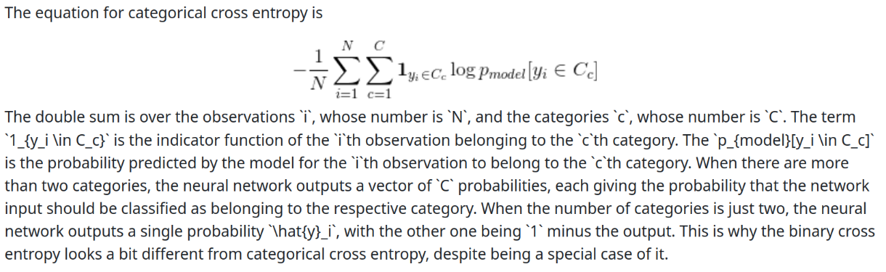

# Practical work 4
## Auteurs :  Dousse Rafael & Baquerizo Emily


### Question 1


```
What is the learning algorithm being used to optimize the weights of the neural
networks?
What are the parameters (arguments) being used by that algorithm?
What loss function is being used ?
Please, give the equation(s)
```

A checker pour chaque exercice mais le 1er c'est:

- raw_data
loss='categorical_crossentropy', optimizer=RMSprop()
parametre:
```
keras.optimizers.RMSprop(
    learning_rate=0.001,
    rho=0.9,
    momentum=0.0,
    epsilon=1e-07,
    centered=False,
    weight_decay=None,
    clipnorm=None,
    clipvalue=None,
    global_clipnorm=None,
    use_ema=False,
    ema_momentum=0.99,
    ema_overwrite_frequency=None,
    loss_scale_factor=None,
    gradient_accumulation_steps=None,
    name="rmsprop",
    **kwargs
)
```
Equation:


Question 2.2 : il faut donner le nombres de paramètres de chaque couche du réseau de neurones (donné par model.summary())
