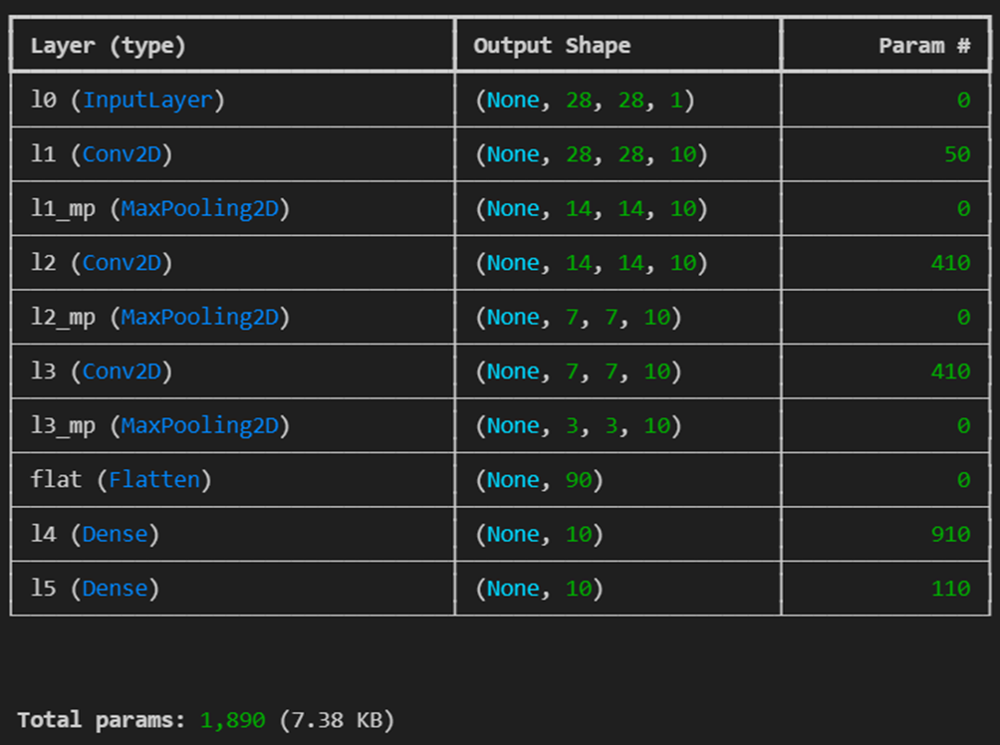

# Practical work 4
## Auteur.e.s :  Dousse Rafael & Baquerizo Emily
## Question 1
 
 Le code fournis dans les trois premier notebook utilise les même optimiseur et la même fonction de perte.
 L'optimiseur utilisé est RMSprop() et la fonction de perte est categorical_crossentropy.
Les paramètres que l'on utilise pour le modèe et que nous modifions nous sont le batch_size et le nombre d'époques.
 RMSprop() a ses porpres paramètres déjà initialisé que nous aurions pu modifié mais nous ne l'avons pas fait. Les paramètres de RMSprop() que nous avons trouvé en ligne sont les suivants:
``` python
keras.optimizers.RMSprop(
    learning_rate=0.001,
    rho=0.9,
    momentum=0.0,
    epsilon=1e-07,
    centered=False,
    weight_decay=None,
    clipnorm=None,
    clipvalue=None,
    global_clipnorm=None,
    use_ema=False,
    ema_momentum=0.99,
    ema_overwrite_frequency=None,
    loss_scale_factor=None,
    gradient_accumulation_steps=None,
    name="rmsprop",
    **kwargs
)
```

Nous avons aussi trouvé en ligne l'équation pour la fonction de perte categorical_crossentropy:


Enfin, nous avons remarqué que pour le notebook que nous avons du compléter pour le CNN_pneumonia, l'optimiseur et la fonction de perte sont différents. Cette fois-ci, `Adam()` est utilisé pour l'optimiseur et  `binary_crossentropy` pour la fonction de perte, ce qui fait sens care nous n'avons que deux classes.
Voici son équation:

  

  Et voici les paramètres de `Adam()` que nous avons trouvé en ligne:

  ``` python
  keras.optimizers.Adam(
    learning_rate=0.001,
    beta_1=0.9,
    beta_2=0.999,
    epsilon=1e-07,
    amsgrad=False,
    weight_decay=None,
    clipnorm=None,
    clipvalue=None,
    global_clipnorm=None,
    use_ema=False,
    ema_momentum=0.99,
    ema_overwrite_frequency=None,
    loss_scale_factor=None,
    gradient_accumulation_steps=None,
    name="adam",
    **kwargs
)
  ```

## Question 2
### Digit recognition for raw data
Après plusieurs essais, nous avons décidé d’utiliser un réseau de neurones ayant une couche cachée, composée de 10 neurones et utilisant la fonction d’activation ReLu, ainsi qu’une couche de sortie, composée également de 10 neurones mais utilisant la fonction d’activation softmax.

En sachant que nous avons 784 inputs et 10 neurones, nous pouvons calculer que pour notre couche cachée, nous avons 784 ∙ 10 = 7840 poids et ainsi trouver que le poids total pour cette couche est de 7840 + 10 = 7850.

La couche de sortie possède, elle, « uniquement » 10 ∙ 10 = 100 poids. Avec également 10 biais, nous avons un poids total de 100 + 10 = 110 pour la couche de sortie.

Grâce à cela, nous pouvons calculer que le nombre total de poids de notre réseau est de : 78450 + 110 = 7960. Cela est confirmé lorsque nous affichons le résumé du model utilisé :


Lors de nos différents tests, nous avons malheureusement oublié de récuperer nos résultats intermédiaire pour pouvoir les comparer à notre choix final.

De ce fait, en se basant uniquement sur notre score : 
<br> <br>
Ainsi que notre graphique et matrice de confusion  :
<p align="center">

&nbsp; &nbsp; &nbsp; &nbsp;

</p>

Nous observons que les prédictions effectuées par notre modèle sont dans la plus grande majorité des cas correctes (visible grâce à la diagonale bleue sur la matrice de confusion). En revanche, si nous observons notre matrice de confusion de plus près, nous constatons que le nombre qui pose le plus de problème à notre modèle est le 8 que ce soit en terme de faux-négatif ou de faux-positif.

### Digit recognition from features of the input data
Pour cet exercice, nous avons décidé d’utiliser un réseau de neurones similaire à celui utilisé lors de la première partie du travail pratique. Nous avons donc une couche cachée, composée de 10 neurones et utilisant la fonction d’activation ReLu, ainsi qu’une couche de sortie, composée également de 10 neurones mais utilisant la fonction d’activation softmax.

Ayant 392 inputs, nous pouvons calculer les poids pour la couche cachée de la même manière que pour la partie précédente : 392 ∙ 10 = 3920 et en n’oubliant pas de rajouter les 10 biais, nous arrivons à un poids total de 3920 + 10 = 3930.

Pour la couche de sortie, nous avons 10 ∙10 = 100 poids avec également 10 biais, ce qui fait un total de poids de 110 pour la couche de sortie.

Ainsi, nous pouvons calculer que nous avons un poids total de : 3930 + 110 = 4040. Cela est confirmé par le résumé du model :


Lors de nos différents tests, nous avons malheureusement oublié de récuperer nos résultats intermédiaires pour pouvoir les comparer à notre choix final.
 
De ce fait, en se basant uniquement sur notre score :
<br><br>

Ainsi que sur notre graphique et matrice de confusion:

<p align="center">

&nbsp; &nbsp; &nbsp; &nbsp;

</p>

Nous observons que les prédictions effectuées par notre modèle sont dans la plus grande majorité des cas correctes (visible grâce à la diagonale en bleue sur la matrice de confusion). En revanche, si nous observons notre matrice de confusion de plus près, nous constatons que quelques nombres ont de moins bon résultats que d'autres. En terme de faux-positifs, aucun nombre ne se démarque plus que les autres, néanmoins, nous constatons que les nombres 2, 3, 8 et 9 semblent être ceux qui engendre le plus de faux-positifs.
Dans le cas des faux-négatifs, nous observons que le 7, 8 et 9 semblent être prédit à tord dans le plus de cas.

### Convolutional neural network digit recognition
Cette 3e partie est, à l’inverse de deux premières, utilise un CNN. Après divers essais, nous avons finalement décidé de garder un modèle composé de 3 couches de convolution chacune accompagnée d’une couche de max pooling. Nos 3 couches convolutives ont 10 filtres d’une taille de 2x2 et utilisent la fonction d’activation ReLu.
Ensuite, nous avons décidé d’utiliser une couche dense avec 10 neurones juste avant la couche de sortie de 10 neurones.


En se basant sur le résumé du modèle ci-dessus, nous constatons  que nous avons un poids total de 1890.

Lors de nos différents tests, nous avons malheureusement oublié de récuperer nos résultats intermédiaires pour pouvoir les comparer à notre choix final.
 
De ce fait, en se basant uniquement sur notre score :
<br><br>

Ainsi que sur notre graphique et matrice de confusion:
<p align="center">

&nbsp; &nbsp; &nbsp; &nbsp;

</p>

Nous observons que les prédictions effectuées par notre modèle sont dans la plus grande majorité des cas correctes (visible grâce à la diagonale bleue sur la matrice de confusion). En revanche, si nous observons notre matrice de confusion de plus près, nous constatons que le nombre qui pose le plus de problème à notre modèle est le 8 que ce soit en terme de faux-négatif ou de faux-positif. De plus, le nombre 9 semble également génerer le plus de faux-positifs et le nombre 6 de faux-négatifs.

### Constatation
De manière général, nos modèles possèdent une accuracy très élévée, notre modèle le moins performant ayant une accuracy de ~0.94.
Toutefois, grâce à nos matrices de confusion, nous avons constaté que le 2 et 9 ont tendance à porter problème à nos modèles, néanmoins le chiffre causant le plus de faux-négatif et de faux-positif reste le chiffre 8.

## Question 3 

Ce n'est pas forcément le cas. Avec un MLP, chaque pixel va être connecté à chaque neurone de la couche suivante ce qui peut nous donner un grand nombre de poids. Alors que pour un CNN, nous allons avoir des filtres qui vont être appliqués sur l'image et qui peuvent avoir la même taille à chaque fois ce qui va réduire le nombre de poids.
Nous pouvons le remarquer avec les notebook fournis:
Le résumé du modèle utilisé dans le fichier `MLP_from_raw_data` nous indique que le nombre total de paramètre est de 7'960 alors que nous n'avons qu'une couche cachée de 10 neuronnes. Alors que le modèle de convolution utilisé dans `CNN`  utilise beaucoup plus de couche et plus de neuronnes mais le nombre total de paramètre est « uniquement » de 1'890.

## Question 4
Pour ce modèle de convolution, nous avons dû compléter le code fournis dans le notebook et suivre les instructions données dans une image présente dans le notebook pour reproduire l'architecture du modèle. 
Voici le code du modèle que nous avons écrit:

``` python
conv_1 = Conv2D(8, (3, 3), padding='same', activation='relu', name='conv_1')(input)
max_pooling_1 = MaxPooling2D(pool_size=(2, 2), name='max_pooling_1')(conv_1)

conv_2 = Conv2D(16, (3, 3), padding='same', activation='relu', name='conv_2')(max_pooling_1)
max_pooling_2 = MaxPooling2D(pool_size=(2, 2), name='max_pooling_2')(conv_2)

conv_3 = Conv2D(32, (3, 3), padding='same', activation='relu', name='conv_3')(max_pooling_2)    
max_pooling_3 = MaxPooling2D(pool_size=(2, 2), name='max_pooling_3')(conv_3)

conv_4 = Conv2D(64, (3, 3), padding='same', activation='relu', name='conv_4')(max_pooling_3)    
max_pooling_4 = MaxPooling2D(pool_size=(2, 2), name='max_pooling_4')(conv_4)

conv_5 = Conv2D(128, (3, 3), padding='same', activation='relu', name='conv_5')(max_pooling_4)    
max_pooling_5 = MaxPooling2D(pool_size=(2, 2), name='max_pooling_5')(conv_5)

flatten_7 = Flatten(name='flatten_7')(max_pooling_5)

dense_21 = Dense(32, activation='relu', name='dense_21')(flatten_7)
dense_22 = Dense(16, activation='relu', name='dense_22')(dense_21)

cnn_output = layers.Dense(1, activation='sigmoid')(dense_22)
```

 Comme expliqué dans la question 1, l'optimiseur utilisé est `Adam()` et la loss est `binary_crossentropy` qui fonctionnent bien ensemble et qui est bien pour classifé deux classes. Nous avons entraîné notre modèle avec 10 epochs. Nous avons testé plusieurs epochs entre 5, 8, 10, 12 et 14 et le paramètre de 10 est celui avec lequel nous avons eu les meilleurs résultats. Voici le graph pour le loss et l'accuracy pour le modèle final:

<p align="center">

&nbsp; &nbsp; &nbsp; &nbsp;

</p>

Chaque fois que nous faisions tourner le modèle, nous obtenions des résultats plutôt similaires avec la validation qui fait des sauts.

Voici les matrices de confusions pour la validation et le test:

<p align="center">

&nbsp; &nbsp; &nbsp; &nbsp;

</p>

<br>
Nous avons obtenu les résultats suivants pour le modèle:

*Validation F1 score: 1.0000 <br>
Validation accuracy: 1.0000 <br>
Test F1 score: 0.8505 <br>
Test accuracy: 0.7821* <br>


Nous avons des très bons résultats pour la validation où le modèle classifie toutes les données correctement. En revanche, pour le test, nous avons des résultats moins corrects, le modèle ayant tendance à prédire des faux-positifs. 
En effet, le dataset de la validation étant pauvre en terme de quantité données utilisées, il est possible que le modèle ait appris par coeur une certaine classification. Cela pourrait être une raison qui expliquerait pourquoi notre modèle a plus de mal à classifier les données du test.
De plus, nous pouvons observer que lors de la validation, nous effectuions nos mesures en utilisant le même nombre d'image de pneumonie que de normal (non-pneumonie) alors que lors du test, nous possèdons un nombre d'image normal (non-pneumonie) plus élevés que d'image contenant une pneumonie.
Par ce fait, notre validation et test ne sont pas représentatifs l'un de l'autre, nos deux dataset ayant des proportionalités différentes des deux catégories d'images. Pour obtenir de meilleur résultat, nous pourrions envisager de se baser sur deux datasets ayant une grandeur et une quantité d'images des deux catégories similaire ou au moins proportionnelle. 