# Object recognition in the wild using Convolutional Neural Networks
### Practical Work 05 – Transfer learning, part 2
#### Étudiants : Rafael Dousse & Emily Baquerizo

## 1. Introduction
Ce travail pratique continue d'utiliser les réseaux de neurones convolutif (CNN) et nous as permit de nous familiariser avec le transfert d'apprentissage. Le transfert d'apprentissage est une technique qui permet de réutiliser un modèle déjà entraîné sur un nouveau problème. Cela permet de réduire le temps d'entraînement et d'augmenter la précision du modèle.
A la fin de l'entrainement, on a aussi pu exporter les neuronnes du modèle pour les utiliser dans une application android.
L'application créée lors de ce labo est un identificateur de panneau de circulation et surtout de leur forme. Pour pouvoir commencer à entraîner notre modèle, nous avons dû de construire une base de données de panneaux. Pour cela, nous avons pris nos propres photos et pour compléter un peu plus notre dataset, nous avons également récupéré quelques photos sur le net.


## 2. Problèmatique
Dû à un manque de variété dans notre dataset, nous nous sommes concentrés sur l'identification des panneaux triangulaire, rectangulaire et rond, ces panneaux étants les plus communs sur nos trajets de tous les jours. Ainsi, nous nous retrouvons avec un dataset rassemblant un peu moins de 180 images avec comme répartition :

- Rectangle : 53 images 
- Rond : 63 images
- Triangle : 63 images

Notre dataset est relativement équilibré, bien que les images de panneaux rectangulaires soient légèrement moins nombreuses que celles des panneaux ronds ou triangulaires. Cette différence est suffisante pour avoir un impact sur les performances de notre modèle.
La taille de notre dataset est un peu petit pour une utilsation plus poussée du projet néanmoins elle reste acceptable dans le cadre de notre laboratoire.

Plusieurs défis compliquent notre tâche de classification :

- Similarités Visuelles : Des panneaux de différentes catégories partagent souvent des couleurs similaires, comme le rouge pour l'arrêt ou l'interdiction, ce qui peut induire en erreur le modèle lorsqu'il doit distinguer entre un panneau rond et un panneau rectangulaire avec un symbole rond à l'intérieur.
   
-  Groupements de Panneaux : Un des problèmes qu'on peut avoir est que les panneaux sont souvent installés en groupes (par exemple, un panneau rond de limitation de vitesse au-dessus d'un panneau rectangulaire avec le nom d'une ville ou même un panneau d'entrée d'autoroute), ce qui rend difficile la capture d'images de panneaux isolés sans autres éléments distracteurs. Lorsque ces images groupées sont utilisées pour l'entraînement, le CNN peut avoir du mal à identifier quel élément de l'image classifier.
   
-  Panneaux Composites : Certains panneaux rectangulaires contiennent des icônes de panneaux ronds, créant une confusion pour le réseau qui peut classer ces images comme rondes plutôt que rectangulaires. Cette confusion est accrue par le fait que le modèle doit apprendre à reconnaître la forme globale du panneau plutôt que l'icône qu'il contient.

## 3. Préparation des données
Notre dataset d'image a subit un pré-traitement pour les préparer pour le model. Pour cela, elles ont tout d'abord été redimensionnée en 224x224 pixels puis normalisée.
Nous avons ensuite procédé à une augmentation des images aléatoires en appliquant des filtres tel qu'un retournement de l'image (horizontal, vertical, ...) ou encore un ajustement du contraste.

Pour l'évaluation du modèle, nous avons divisé nos données en ensembles d'entraînement, de validation et de test selon les proportions suivantes :

- Set d'entraînement : Utilisé pour l'apprentissage du modèle, comprenant 70% des images disponibles. Cet ensemble comprend des images augmentées pour diversifier les exemples d'entraînement.

- Set de validation : Comprend 15% des images, utilisé pour ajuster les hyperparamètres et éviter le surapprentissage. Cet ensemble aide à évaluer la performance du modèle pendant l'entraînement.

- Set de test : Constitue les 15% restants des images et est utilisé pour évaluer la performance finale du modèle. Cet ensemble est la pour tester la capacité de notre modèle à classifier de nouvelles données non vues pendant l'entraînement.

Pour le test et la validation, l'utilisation des images augmentée n'est pas idéale puisqu'elles ne reflètent pas les panneaux dans la réalité. N'ayant pas vu cette indication lors de l'écriture du code, nous avons utilisé les images augmentées dans le test et la validation et quand nous avons parlé avec notre assistant et appris qu'on ne devait pas le faire, nous n'avons pas eu de temps pour rechanger le code mais dans une situation optimale, l'ajout d'images augmentées dans les ensemble de validation et entrainement est a évité. Voici un exemple d'images augmentées :

<p align="center">
<br> Exemple d'images augmentées <br>
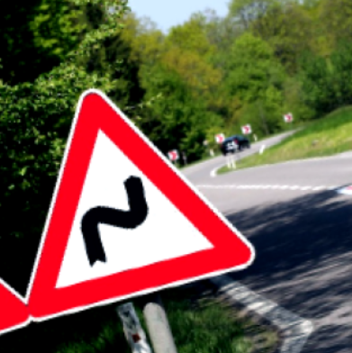
&nbsp; &nbsp; &nbsp; &nbsp;
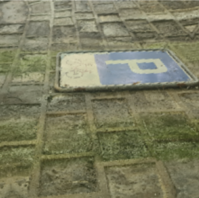
</p>

## 4. Création du model

Pour la création de notre modèle, nous avons opté pour l'utilisation de 10 epoch ainsi que pour l'utilisation de la fonction d'optimisation RMSprop. Le learning rate n'a pas été choisi de manière explicite mais l'utilisation de RMSprop implique l'utilisation d'un learning rate adapté.

```python
NB_EPOCHS = 10
model.compile(
    optimizer = RMSprop(),
    loss = SparseCategoricalCrossentropy(),
    metrics = ['acc']
)
```

L'architecture de notre modèle final est basé sur celle de MobileNetV2 avec quelques couches supplémentaires permettant d'apater le modèle à la classification de panneaux de signalisation. Les 4 couches ajoutées sont les suivantes : une couche GlobalAveragePooling2D, une couche de densité avec 1024 neurones et utilisation la fonction d'activation ReLu, une couche de dropout avec un taux de 0.5 et une dernière fouche de densité avec 3 neurones et utilisant la fonction d'activation softmax.
Nous avons opté pour un GlobalAveragePooling à la place d'un Flatten() pour réduire le nombre de paramètres utilisés.

```python
def get_model():
    base_model = MobileNetV2(
        input_shape=(224, 224, 3),
        weights='imagenet',
        include_top=False
    )

    layers = base_model.output

    added_layers = [
        GlobalAveragePooling2D(),
        Dense(1024, activation='relu'),
        Dropout(0.5),
        # 3 is the number of classes
        Dense(3, activation='softmax')
    ]

    model = Model(inputs=base_model.input, outputs=Sequential(added_layers)(layers))

    for layer in base_model.layers:
        layer.trainable = False

    model.compile(
      optimizer = RMSprop(),
      loss = SparseCategoricalCrossentropy(),
      metrics = ['acc']
    )

    return model
```

Ainsi, notre modèle possède un total de 1'314'819 paramètres entraînables.


Pour effectuer le transfer learning, nous avons première récuépéré le modèle issue de MobileNetV2, puis gelé les premières couches et rajouté les nouvelles couches mentionnées plus haut pour entraîner le modèle sur l'utilisation désirée. Cette utilisation du transfer learning possède plusieurs avantages :
1. Exploiter des connaissances acquises par le modèle déjà entraîné. Par exemple, la reconnaissance de couleur ou encore de texte.
2. Réduction du temps d'entraînement car il n'est pas nécessaire d'entraînement les premières couches du modèle.
3. Amélioration des performances malgré un dataset de petite taille. Ce dernier point étant imporant pour nous dû à la taille de notre dataset.


## 5. Résultat

<p style="text-align: center;"><b> Graphique </b></p>

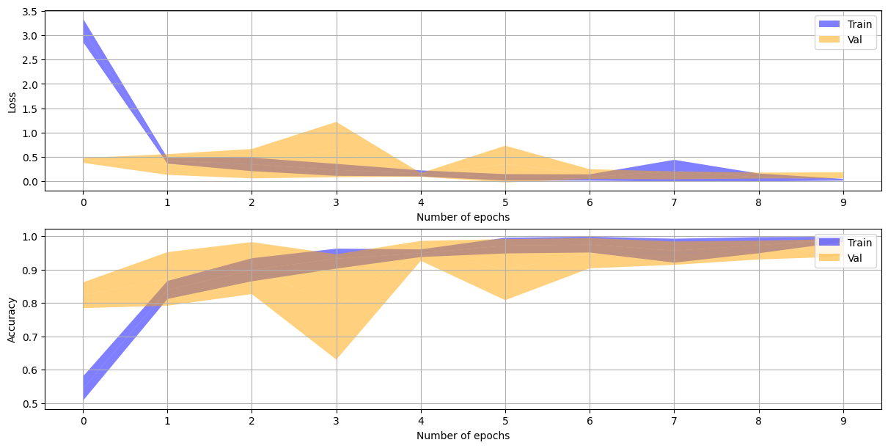

<br></br>

<p style="text-align: center;"><b> Matrice de confusion </b></p>

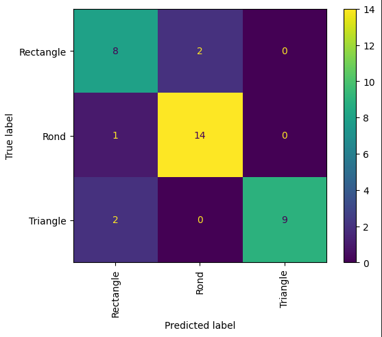

Voici notre F-1 score ainsi que notre accuracy pour le test :
F1 score:  0.855
Accuracy:  0.86

L'accuracy du modèle pour le test est de 86.11%. Cette performance est assez proche de ce qui a été observé durant la validation et durant l'entraînement, ce qui suggère que le modèle généralise bien sur de nouvelles données qui non pas été vues durant l'entraînement.
Dans le monde réel, notre modèle est assez performant. Il arrive bien à identifier les panneaux avec des précisions proche des 98% quand les panneaux sont isolés. Cependant, il a plus de mal à identifier les panneaux lorsqu'ils sont groupés avec d'autres panneaux comme c'était à prévoire ainsi que les panneaux rectangulaire avec un symbole rond à l'intérieur.


Les images grad-cam montrent que le modèle concentre son attention sur les zones pertinentes des panneaux, comme les symboles et les formes distinctives. Par exemple, pour les panneaux ronds, l'activation est centrée autour du cercle, tandis que pour les triangles, l'activation est forte aux bords et au centre des panneaux.

<p align="center">
<br><b> Grad cam </b><br>
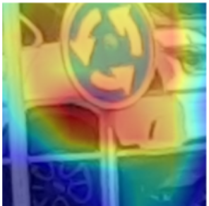
&nbsp; &nbsp; &nbsp; &nbsp;
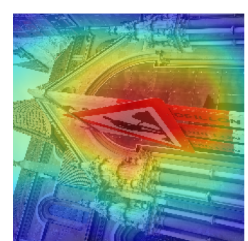
&nbsp; &nbsp; &nbsp; &nbsp;

&nbsp; &nbsp; &nbsp; &nbsp;
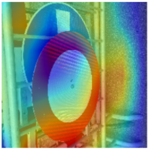
</p>


Ces activations indiquent que notre modèle a appris à reconnaître certaines des caractéristiques spécifiques qui définissent chaque type de panneau de signalisation.  Donc il a bien "appris" à différencier les formes des panneaux.
Bien sûre ce n'est pas parfait.

Certaines des erreurs de classification sont les suivantes:

Pour l'image qui suit, on peut comprendre que le modèle ait eu du mal à identifier le panneau car il est de côté et que l'image se concentre plus sur le fond que sur le panneau lui-même.

<p align="center">
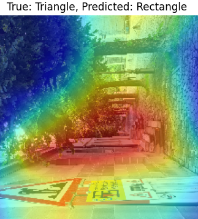
</p>

Par contre, pour cette image, nous avons du mal a comprendre pourquoi le modèle se concentre sur une partie de mur a la place du panneau rond ( ou meme le petit panneau rectangulaire qui se trouve en dessous ). On peut concevoir que les panneaux soient éloignés mais pas énormément non plus.

<p align="center">
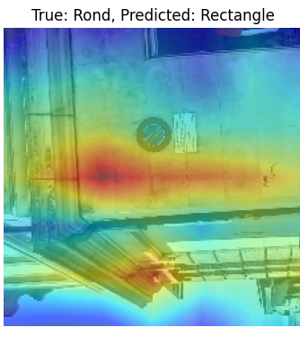
</p>

Sur l'image qui suit on comprends que le modèle ait eu du mal à identifier le panneau car c'est une des images augmentées et l'image est donc pas mal floue. C'est une des raisons pour laquelle on n'aurait pas dû utiliser les images augmentées pour le test et la validation.

<p align="center">
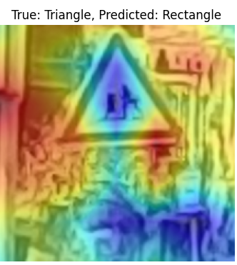
</p>

Comme déjà dit, on voit que dans cette image de panneau rectangulaire, c'est plus sur la forme ronde qu'il va se concentrer.

<p align="center">
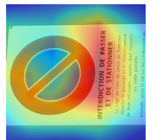
</p>

Si on utilise notre modèle sur d'autres choses que des panneaux, on va avoir des sides-effect assez intéressant. Si on lui montre un humain, il va en principe l'identifier comme rond. Mais ce qui est intéressant c'est que si par exemple on dessinait un rond ou un triangle sur un tableau noir, il va parfaitement les identifiers. En générale, tout ce qui n'est pas un panneau mais a une forme de celles qui sont classifier et entrainé par notre modèle, il va les identifier comme tel. Au final, on aurait pu définir notre modèle comme un classifier de formes en générale et pas seulement de panneaux.

## 6. Conclusion
Ce labo nous a permit de nous familiarisé encore plus avec les réseaux de neurones convolutifs (CNN), découvrir le transfert d'apprentissage et entrainé notre propre modèle  dans la reconnaissance de formes spécifiques de panneaux de circulation.

En exploitant un modèle pré-entraîné (MobileNetV2) et en l'adaptant à nos besoins spécifiques, nous avons réussi à développer un système capable d'identifier les formes des panneaux avec une bonne précision, malgré un ensemble de données relativement restreint et les soucis qu'on a pu avoir avec nos images.

Pour améliorer les résultats futurs, nous pourrions augmenter la taille du jeu de données et équilibrer le nombre d'exemples par classe et surtout ne pas mettre d'images augmentées dans les tests et validations.
